# Deep Fluids: A Generative Network for Parameterized Fluid Simulations

Tensorflow implementation of [Deep Fluids: A Generative Network for Parameterized Fluid Simulations](http://www.byungsoo.me/project/deep-fluids).

[Byungsoo Kim](http://www.byungsoo.me)¹, [Vinicius C. Azevedo](http://graphics.ethz.ch/~vviniciu/)¹, [Nils Thuerey](https://ge.in.tum.de/)², [Theodore Kim](http://www.tkim.graphics/)³, [Markus Gross](https://graphics.ethz.ch/people/grossm)¹, [Barbara Solenthaler](https://graphics.ethz.ch/~sobarbar/)¹

¹ETH Zurich, ²Technical University of Munich, ³Pixar Animation Studios

Computer Graphics Forum (Proceedings of Eurographics 2019)

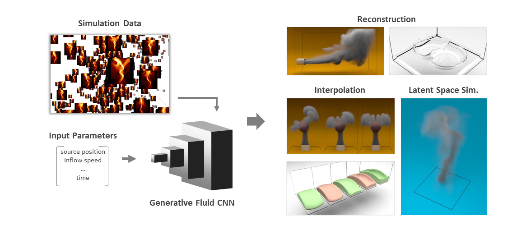

## Requirements

This code is tested on Windows 10 and Ubuntu 16.04 with the following requirements:

<!-- - [anaconda / python3.6](https://www.anaconda.com/download/) (run `conda install python=3.6` for the latest version.) -->
- [TensorFlow 1.15](https://www.tensorflow.org/install/)
- [mantaflow](http://mantaflow.com)

Run the following line to install packages.

    $ pip install --upgrade tensorflow==1.15 tqdm matplotlib Pillow imageio

To install `mantaflow`, run:

    $ git clone https://bitbucket.org/mantaflow/manta.git
    $ git checkout 15eaf4
    
and follow the [instruction](http://mantaflow.com/install.html). Note that `numpy` cmake option should be set to enable support for numpy arrays. (i.e., `-DNUMPY='ON'`)

## Usage

Run a script for the dataset generation using mantaflow. For instance,

    $ ..\manta\build\Release\manta.exe .\scene\smoke_pos_size.py

To train:
    
    $ python main.py

To test:
    
    $ python main.py --is_train=False --load_path=MODEL_DIR

Please take a closer look at `run.bat` for each dataset and other architectures.

## Result (2D)

### Reconstruction from each parameter after 100 epochs (From top to bottom: position / width / time)

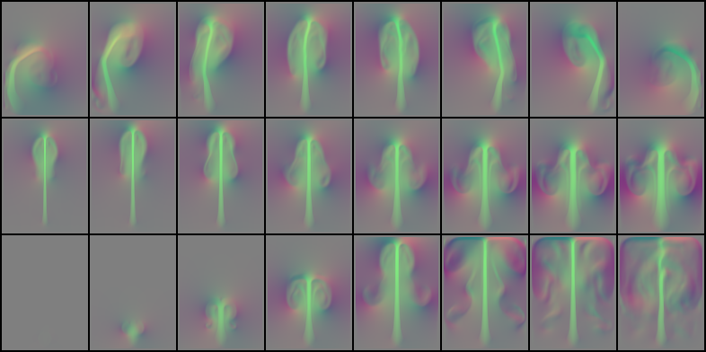

### Reconstruction of random samples after 100 epochs (Top: reconstructed, bottom: ground truth)

In each image, the top row shows velocity profiles, and the bottom row shows vorticity profiles.

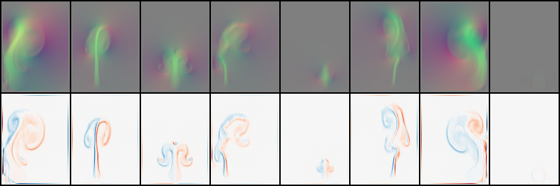

## Result (3D)

### Reconstruction from each parameter after 100 epochs. (From top to bottom: in-flow velocity / buoyancy / time)

The left image shows the middle slice of xy domain, and the right image is the middle slice view of zy domain.

In each image, the top three rows are velocity profiles, and the rest rows are vorticity profiles.

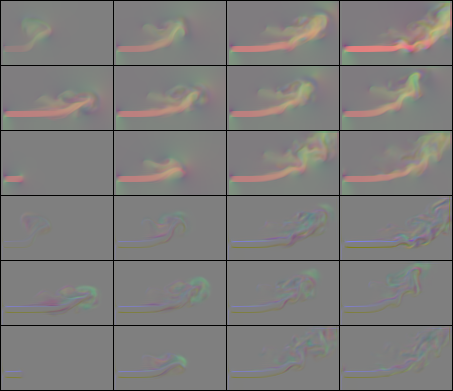 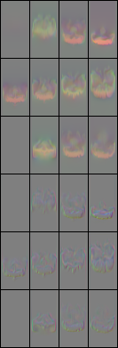

### Reconstruction of random samples after 100 epochs (Top: reconstructed (xy-zy), bottom: ground truth (xy-zy))

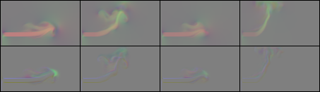 

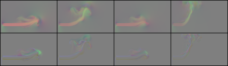 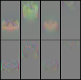

## Result (Autoencoder)

### Reconstruction (2D) of random samples after 10 epochs (Top: reconstructed, bottom: ground truth)

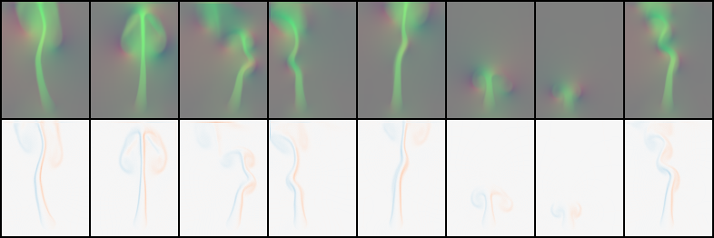

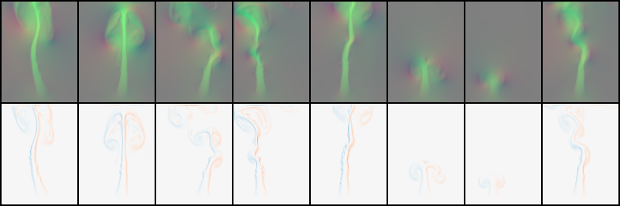

### Reconstruction (3D) of random samples after 10 epochs (Top: reconstructed (xy-zy), bottom: ground truth (xy-zy))

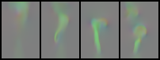 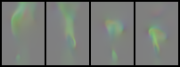

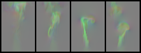 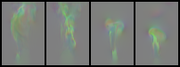

## Author

[Byungsoo Kim](http://www.byungsoo.me) / [@byungsook](https://github.com/byungsook)